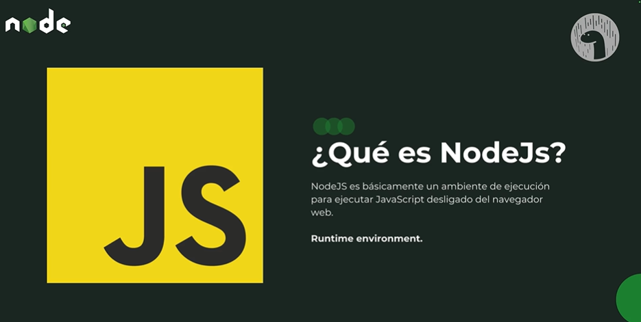
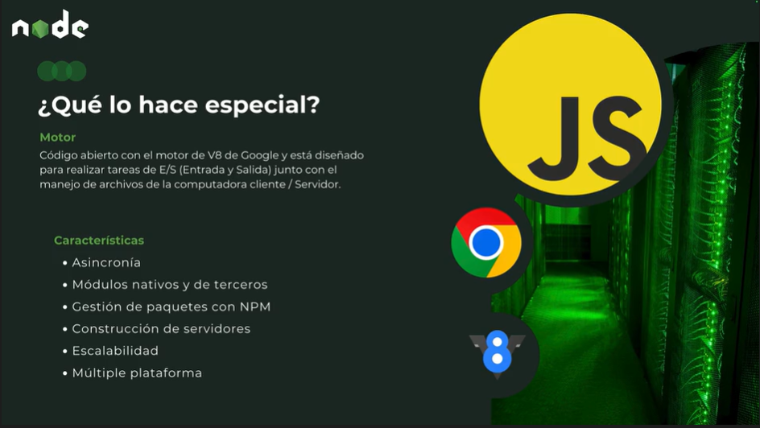
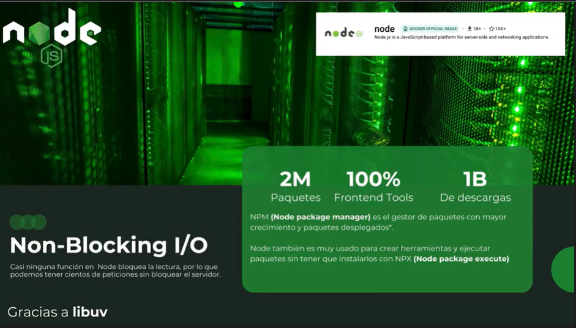
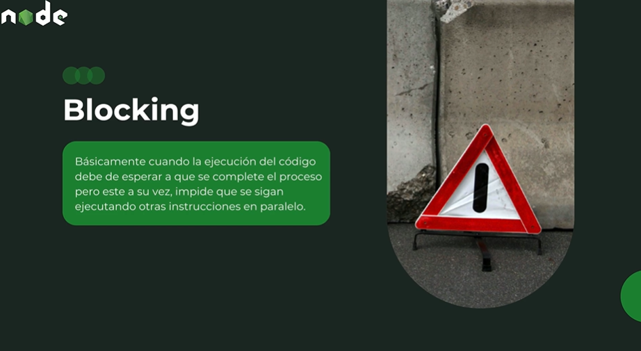

# NodeJS



**Node.js** es un **entorno de ejecución de JavaScript en el servidor**. Permite ejecutar código JavaScript fuera del navegador, lo que lo hace ideal para construir aplicaciones backend.

### 🚀 **Características principales de Node.js**



1. **Basado en V8** → Usa el motor de JavaScript de Chrome para ejecutar código rápidamente.
2. **Asíncrono y No Bloqueante** → Usa un event loop para manejar múltiples peticiones sin bloquear el servidor.
3. **Single-threaded con I/O asincrónico** → Maneja muchas conexiones con un solo hilo, optimizando el rendimiento en tareas de I/O como bases de datos y APIs.
4. **Ecosistema gigante (NPM)** → Tiene miles de paquetes en **npm (Node Package Manager)** para añadir funcionalidades rápidamente.
5. **Compatible con TypeScript** → Puedes escribir código más seguro con **TypeScript** en lugar de JavaScript puro.

### 🔥 **¿Para qué se usa Node.js?**

✅ **APIs REST y GraphQL** (Express.js, NestJS)  
✅ **Aplicaciones en tiempo real** (chats, sockets con Socket.io)  
✅ **Microservicios y Serverless** (AWS Lambda, Firebase Functions)  
✅ **Aplicaciones con mucha concurrencia** (pero sin procesamiento intensivo)  
✅ **Backends para apps web y móviles** (React, Angular, Vue, React Native)

---

💡 **¿Lo necesitas?**  
Si trabajas con **JavaScript/TypeScript** en el frontend, **Node.js** es una opción natural para el backend porque puedes compartir código y usar el mismo lenguaje en toda la app.

## Que es un entorno de ejecución de JavaScript en el servidor?

Un **entorno de ejecución de JavaScript en el servidor** es un programa que permite ejecutar código JavaScript **fuera del navegador**.

### 🌍 **Antes de Node.js**

JavaScript solo se ejecutaba en navegadores como Chrome, Firefox o Edge, donde servía para hacer páginas interactivas.

### 🚀 **Con Node.js**

Ahora puedes escribir código JavaScript **para el backend**, lo que significa que puedes:  
✅ Manejar bases de datos  
✅ Crear servidores web  
✅ Gestionar autenticación de usuarios  
✅ Construir APIs y microservicios

### 🔥 **Cómo funciona Node.js**

Node.js usa **V8**, el motor de JavaScript de Google Chrome, pero lo ejecuta **en un servidor** en lugar de en un navegador.

También usa un modelo **asíncrono y no bloqueante**, lo que significa que puede manejar **miles de conexiones simultáneamente** sin atascarse.

---

💡 **Ejemplo simple de un servidor en Node.js**

```js
const http = require("http");

const server = http.createServer((req, res) => {
  res.writeHead(200, { "Content-Type": "text/plain" });
  res.end("¡Hola, mundo desde Node.js!");
});

server.listen(3000, () => {
  console.log("Servidor ejecutándose en http://localhost:3000");
});
```

Este código inicia un **servidor web** en Node.js que responde con "¡Hola, mundo!" en el puerto 3000.

🔹 **Resumen:**  
Un entorno de ejecución como Node.js permite usar JavaScript para crear **servidores web, manejar datos y construir aplicaciones backend**, en lugar de solo ejecutarlo en el navegador.

## Qué es el motor V8?

### 🚀 **V8: El Motor de JavaScript de Google**

**V8** es un **motor de JavaScript de alto rendimiento** desarrollado por **Google**. Es el encargado de ejecutar código JavaScript en navegadores como **Google Chrome** y en entornos de servidor como **Node.js**.

---

### 🔥 **¿Qué hace V8?**

Cuando escribes código JavaScript, este no se ejecuta directamente en tu CPU, sino que primero necesita ser **interpretado y convertido en código de máquina**.

V8 se encarga de:  
✅ **Compilar** JavaScript a código máquina en lugar de interpretarlo línea por línea.  
✅ **Optimizar** el código para que se ejecute rápido.  
✅ **Manejar memoria y recolección de basura** automáticamente.

---

### ⚡ **¿Por qué V8 es tan rápido?**

1️⃣ **Compilación Just-In-Time (JIT)**: Usa **Ignition** (un intérprete rápido) y **TurboFan** (un compilador optimizado) para traducir JavaScript a código máquina al vuelo.  
2️⃣ **Optimización agresiva**: V8 analiza el código en tiempo real y optimiza funciones que se usan con frecuencia.  
3️⃣ **Uso eficiente de la memoria**: Gestiona la memoria automáticamente con un **recolector de basura**.

---

### 🔧 **¿Dónde se usa V8?**

- **Google Chrome** y otros navegadores basados en Chromium.
- **Node.js** (para ejecutar JavaScript en el backend).
- **Deno** (otra plataforma moderna para JavaScript y TypeScript).

---

### 💡 **Ejemplo: Código JavaScript ejecutándose en V8**

```js
function saludar() {
  console.log("Hola, mundo!");
}

saludar();
```

Cuando este código se ejecuta en Chrome o Node.js, **V8** lo traduce a código de máquina y lo ejecuta.

📌 **Resumen:**  
**V8 es el motor que hace que JavaScript sea rápido**. Es el corazón de **Chrome y Node.js**, optimizando la ejecución de código JavaScript mediante compilación JIT y optimizaciones avanzadas. 🚀

## 🔍 Blocking vs Non-Blocking en Programación

En el desarrollo de software, especialmente en **backend** y **procesamiento de datos**, los términos **Blocking** y **Non-Blocking** se refieren a cómo un programa maneja la ejecución de tareas y el tiempo de espera de operaciones.

---

## **🛑 1. ¿Qué es Blocking?**

Cuando una operación es **blocking**, significa que **bloquea** la ejecución del programa hasta que la tarea se complete. Durante ese tiempo, el programa no puede hacer otra cosa y debe esperar a que la operación termine.

### **Ejemplo en JavaScript (Síncrono / Blocking)**

```js
const fs = require("fs");

// Lectura de archivo de forma blocking (síncrona)
const data = fs.readFileSync("archivo.txt", "utf-8");

console.log("El archivo fue leído completamente.");
console.log(data); // Solo se ejecuta después de leer el archivo.
```

🔹 **¿Qué pasa aquí?**  
1️⃣ `readFileSync` bloquea la ejecución hasta que la lectura del archivo termine.  
2️⃣ Solo después de completar la operación, se ejecuta el `console.log`.

⏳ **Desventaja**: En un servidor web, si una operación bloquea el hilo principal, otros clientes deben esperar, lo que reduce la escalabilidad.

---

## **⚡ 2. ¿Qué es Non-Blocking?**

En una operación **non-blocking**, el programa **no espera** a que la tarea termine. En su lugar, sigue ejecutando otras instrucciones y, cuando la tarea asíncrona se completa, ejecuta una función de callback.






[Documentación](https://nodejs.org/en/learn/asynchronous-work/overview-of-blocking-vs-non-blocking)

### **Ejemplo en JavaScript (Asíncrono / Non-Blocking)**

```js
const fs = require("fs");

// Lectura de archivo de forma non-blocking (asíncrona)
fs.readFile("archivo.txt", "utf-8", (err, data) => {
  if (err) throw err;
  console.log("El archivo fue leído completamente.");
  console.log(data);
});

console.log("Esta línea se ejecuta mientras se lee el archivo.");
```

🔹 **¿Qué pasa aquí?**  
1️⃣ `readFile` inicia la lectura del archivo, pero **no detiene la ejecución** del código.  
2️⃣ La función `console.log("Esta línea se ejecuta mientras se lee el archivo.")` se ejecuta **antes** de que termine la lectura.  
3️⃣ Cuando la operación asíncrona finaliza, ejecuta el **callback** y muestra el contenido del archivo.

🚀 **Ventaja**: Permite manejar múltiples operaciones sin bloquear el flujo del programa, mejorando el rendimiento y la escalabilidad.

---

## **📊 Diferencias Clave**

| Característica  | Blocking (Síncrono)                  | Non-Blocking (Asíncrono)                      |
| --------------- | ------------------------------------ | --------------------------------------------- |
| Ejecución       | Se detiene hasta completar la tarea. | No se detiene, sigue ejecutando otras tareas. |
| Uso de recursos | Ineficiente si hay tareas largas.    | Eficiente y escalable.                        |
| Ejemplo         | `readFileSync()` en Node.js          | `readFile()` con callback o promesas.         |
| Aplicaciones    | Scripts pequeños, programas simples. | Servidores web, aplicaciones concurrentes.    |

---

## **🎯 Conclusión**

- **Blocking**: Útil cuando la ejecución secuencial es crítica y no importa esperar (ejemplo: scripts simples).
- **Non-Blocking**: Ideal para **servidores web** y **aplicaciones concurrentes**, ya que mejora el rendimiento y la escalabilidad.

📌 **Ejemplo real**: Node.js usa un **modelo non-blocking** basado en eventos para manejar miles de solicitudes sin bloquear el servidor. 🔥

## **📌 ¿Qué significa "basado en eventos" en programación?**

Un sistema **basado en eventos** funciona escuchando eventos y respondiendo cuando ocurren. En lugar de ejecutar tareas de manera secuencial, el sistema **espera eventos** (como clics, solicitudes HTTP, respuestas de una API) y ejecuta funciones asociadas a esos eventos.

🔹 **Ejemplo en JavaScript con eventos**

```js
document.getElementById("boton").addEventListener("click", () => {
  console.log("El botón fue presionado");
});
```

📌 **Explicación**:  
1️⃣ `addEventListener` **escucha** el evento de clic.  
2️⃣ Cuando el usuario hace clic en el botón, se ejecuta la función que muestra `"El botón fue presionado"`.  
3️⃣ Mientras tanto, el código sigue ejecutando otras tareas sin bloquearse.

🔥 **Node.js usa un modelo basado en eventos** donde muchas operaciones (como leer archivos o hacer peticiones a una API) se manejan sin bloquear el hilo principal.

---

## **🔄 ¿Qué es Síncrono vs Asíncrono?**

La diferencia entre **síncrono** y **asíncrono** está en **cómo se manejan las tareas** dentro de un programa.

### **⏳ 1. Código Síncrono (Blocking)**

Las tareas se ejecutan **una tras otra**, esperando a que cada una termine antes de continuar.

🔹 **Ejemplo en JavaScript**

```js
console.log("Inicio");
console.log("Tarea 1 completada");
console.log("Fin");
```

📌 **Salida**:

```
Inicio
Tarea 1 completada
Fin
```

🚨 **Problema**: Si una tarea tarda mucho, todo lo demás se detiene.

---

### **⚡ 2. Código Asíncrono (Non-Blocking)**

Las tareas pueden ejecutarse en **segundo plano**, permitiendo que el programa continúe con otras instrucciones mientras la tarea asíncrona se completa.

🔹 **Ejemplo en JavaScript con `setTimeout` (simula una tarea larga)**

```js
console.log("Inicio");

setTimeout(() => {
  console.log("Tarea 1 completada (después de 2 segundos)");
}, 2000);

console.log("Fin");
```

📌 **Salida esperada**:

```
Inicio
Fin
Tarea 1 completada (después de 2 segundos)
```

📌 **Explicación**:  
1️⃣ `setTimeout` inicia una tarea que tomará **2 segundos**, pero no bloquea el código.  
2️⃣ Se ejecuta `"Fin"` mientras la otra tarea sigue corriendo en segundo plano.  
3️⃣ Cuando pasa el tiempo, se ejecuta `"Tarea 1 completada"`.

🚀 **Ventaja**: Permite manejar múltiples tareas al mismo tiempo, sin detener la ejecución principal.

---

## **⏳ ¿Qué es `async/await`?**

`async/await` es una forma moderna y clara de manejar código asíncrono en JavaScript, basada en **promesas**.

### **🔹 ¿Cómo funciona `async/await`?**

1️⃣ `async` convierte una función en **asíncrona**, permitiendo el uso de `await`.  
2️⃣ `await` **pausa** la ejecución de la función hasta que la promesa se resuelva.

### **🔹 Ejemplo sin `async/await` (usando Promesas y `.then()`)**

```js
function obtenerDatos() {
  return new Promise((resolve) => {
    setTimeout(() => {
      resolve("Datos obtenidos después de 2 segundos");
    }, 2000);
  });
}

console.log("Inicio");
obtenerDatos().then((data) => console.log(data));
console.log("Fin");
```

📌 **Salida**:

```
Inicio
Fin
Datos obtenidos después de 2 segundos
```

---

### **🔹 Ejemplo con `async/await`**

```js
async function obtenerDatos() {
  console.log("Inicio");

  const data = await new Promise((resolve) => {
    setTimeout(() => {
      resolve("Datos obtenidos después de 2 segundos");
    }, 2000);
  });

  console.log(data);
  console.log("Fin");
}

obtenerDatos();
```

📌 **Salida**:

```
Inicio
(DESPUÉS DE 2 SEGUNDOS...)
Datos obtenidos después de 2 segundos
Fin
```

📌 **Explicación**:  
1️⃣ La función `obtenerDatos()` es **asíncrona**.  
2️⃣ `await` **pausa** la ejecución hasta que la promesa se resuelve.  
3️⃣ El código sigue de manera **más clara** que con `.then()`.

✅ **Ventajas de `async/await`**:

- Hace que el código sea **más fácil de leer y escribir**.
- Evita el problema del **callback hell** (muchos `.then()` anidados).

---

## **🎯 Conclusión**

- **Basado en eventos**: Un modelo donde el código responde a eventos sin bloquear la ejecución.
- **Síncrono**: Las tareas se ejecutan **una por una**, bloqueando la ejecución.
- **Asíncrono**: Las tareas pueden ejecutarse en segundo plano, sin bloquear el código.
- **`async/await`**: Facilita la escritura y lectura del código asíncrono, mejorando su estructura.

🚀 **Si trabajas con Node.js, manejar asincronía con `async/await` es clave para escribir código eficiente y escalable.**

Vamos a desglosar técnicamente cómo funciona el **Event Loop** y cómo `async/await` interactúa con él en **JavaScript y Node.js**.

---

# **🌀 ¿Qué es el Event Loop?**

El **Event Loop** es el mecanismo que permite que JavaScript maneje operaciones asíncronas sin bloquear el hilo principal. Es crucial porque **JavaScript es de un solo hilo (single-threaded)**, lo que significa que solo puede ejecutar una tarea a la vez.

### **📌 Paso a paso del Event Loop**

1. **Call Stack (Pila de llamadas)**

   - Es una estructura LIFO (**Last In, First Out**) donde se almacenan las funciones que se ejecutan.

2. **Web APIs / Background Tasks**

   - Cuando una función asíncrona se ejecuta (como `setTimeout` o una petición HTTP), se delega a una API del navegador o al sistema en Node.js.

3. **Callback Queue (Cola de tareas)**

   - Una vez que una tarea asíncrona se completa, su callback se coloca en la **cola de tareas** (`callback queue`).

4. **Microtask Queue (Cola de microtareas)**

   - Contiene tareas de **promesas resueltas** (`.then()` y `async/await`). Estas se ejecutan antes que las tareas de la **callback queue**.

5. **El Event Loop**
   - Verifica si la **call stack está vacía**.
   - Si está vacía, toma las tareas de la **microtask queue** y luego de la **callback queue**.

---

## **📌 Ejemplo práctico del Event Loop**

```js
console.log("Inicio");

setTimeout(() => {
  console.log("Timeout 1");
}, 0);

Promise.resolve().then(() => console.log("Promesa resuelta"));

console.log("Fin");
```

### **📌 Explicación paso a paso**

1️⃣ `"Inicio"` y `"Fin"` se ejecutan inmediatamente porque están en la **Call Stack**.  
2️⃣ `setTimeout` se delega a las **Web APIs**, y su callback va a la **Callback Queue**.  
3️⃣ La promesa resuelta (`.then()`) se coloca en la **Microtask Queue**.  
4️⃣ El Event Loop prioriza la **Microtask Queue**, por lo que `"Promesa resuelta"` se ejecuta antes que `"Timeout 1"`.  
5️⃣ Finalmente, `"Timeout 1"` se ejecuta desde la **Callback Queue**.

📌 **Salida esperada**:

```
Inicio
Fin
Promesa resuelta
Timeout 1
```

---

# **🔄 Cómo `async/await` interactúa con el Event Loop**

El `async/await` es solo **azúcar sintáctico** sobre las promesas y sigue el mismo comportamiento que `.then()`, usando la **Microtask Queue**.

### **📌 Ejemplo con `async/await`**

```js
console.log("Inicio");

async function ejemplo() {
  console.log("Dentro de async");

  await new Promise((resolve) => setTimeout(resolve, 2000));

  console.log("Después del await");
}

ejemplo();

console.log("Fin");
```

### **📌 Explicación paso a paso**

1️⃣ `"Inicio"` se ejecuta primero.  
2️⃣ La función `ejemplo()` se ejecuta y muestra `"Dentro de async"`.  
3️⃣ `await` pausa la ejecución de la función hasta que la promesa se resuelve.  
4️⃣ `"Fin"` se ejecuta porque `ejemplo()` quedó en espera.  
5️⃣ Después de 2 segundos, `"Después del await"` se ejecuta.

📌 **Salida esperada**:

```
Inicio
Dentro de async
Fin
(DESPUÉS DE 2 SEGUNDOS...)
Después del await
```

---

## **🔍 Diferencia clave entre `setTimeout` y `await`**

|                           | **setTimeout** | **await**                                      |
| ------------------------- | -------------- | ---------------------------------------------- |
| **Tipo de cola**          | Callback Queue | Microtask Queue                                |
| **Prioridad**             | Menor          | Mayor                                          |
| **Bloquea la ejecución?** | No             | Suspende la función, pero no el hilo principal |

📌 **Ejemplo combinado**:

```js
console.log("Inicio");

setTimeout(() => console.log("Timeout"), 0);

async function test() {
  await Promise.resolve();
  console.log("Async/Await");
}

test();

console.log("Fin");
```

📌 **Salida esperada**:

```
Inicio
Fin
Async/Await
Timeout
```

📌 **Explicación**:
1️⃣ `"Inicio"` y `"Fin"` se ejecutan primero.  
2️⃣ `test()` coloca su promesa en la **Microtask Queue**.  
3️⃣ `"Async/Await"` se ejecuta antes que `"Timeout"` porque las microtareas tienen prioridad.

---

# **🎯 Resumen**

✅ **Event Loop** maneja la ejecución asíncrona en JavaScript.  
✅ **Microtask Queue (Promesas, `async/await`)** tiene mayor prioridad que la **Callback Queue (`setTimeout`)**.  
✅ **`await` suspende solo la función, no bloquea el hilo principal**.  
✅ **Comprender esto ayuda a escribir código asíncrono eficiente y evitar bloqueos.**

🔥 **¡Ahora ya entiendes cómo funciona internamente `async/await` con el Event Loop!** 🚀
